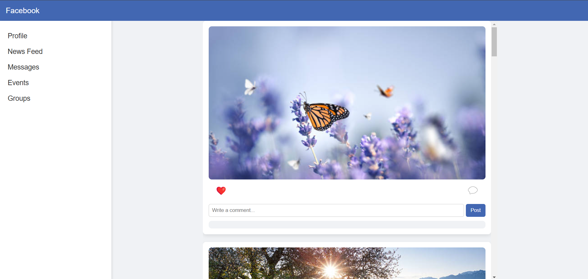
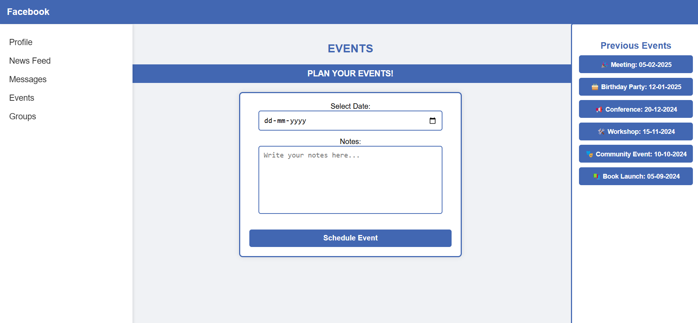
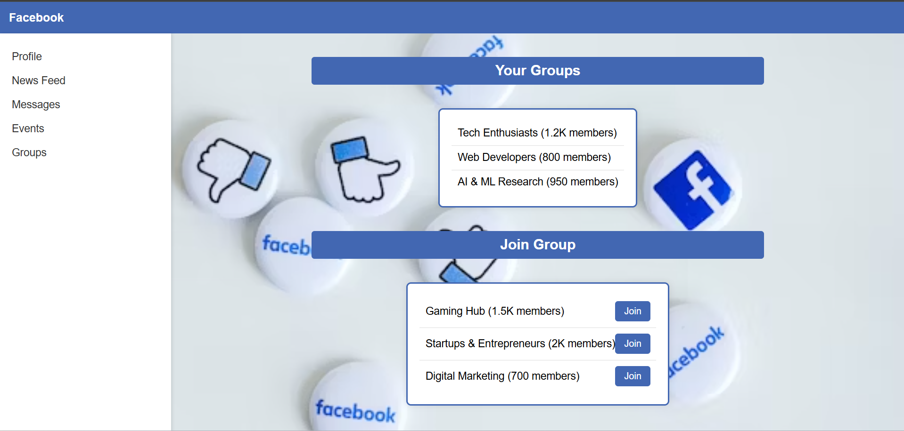
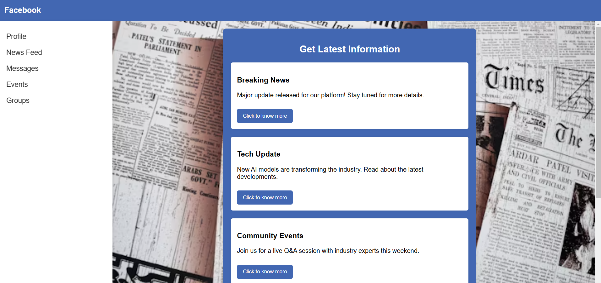
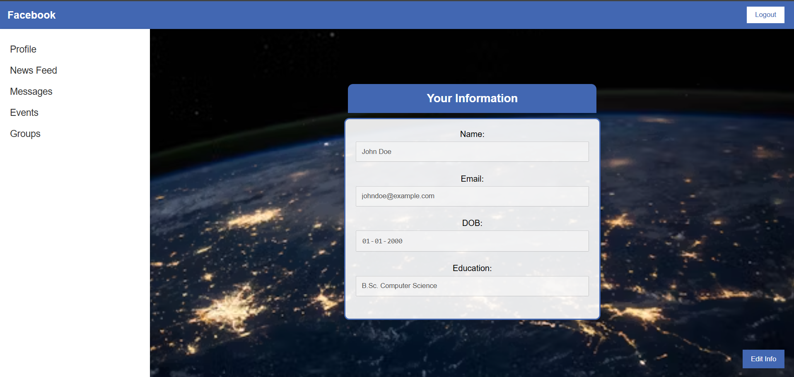

# Facebook Clone  

This is a **Facebook Clone** created using **HTML, CSS, and JavaScript**. The project replicates the design and functionality of Facebook's user interface, including a navbar, sidebar, post section, and interactive features.

## 🚀 Features  
- Facebook-like UI with responsive design  
- Fixed header and sidebar  
- Post creation and interaction  
- JavaScript-based functionality  

## 📸 Screenshots  
Below are some screenshots of the project:

### 🔹 **Homepage**

### 🔹 **Events Page**

### 🔹 **Groups Page**

### 🔹 **Newsfeed Page**

### 🔹 **Profile Page**

